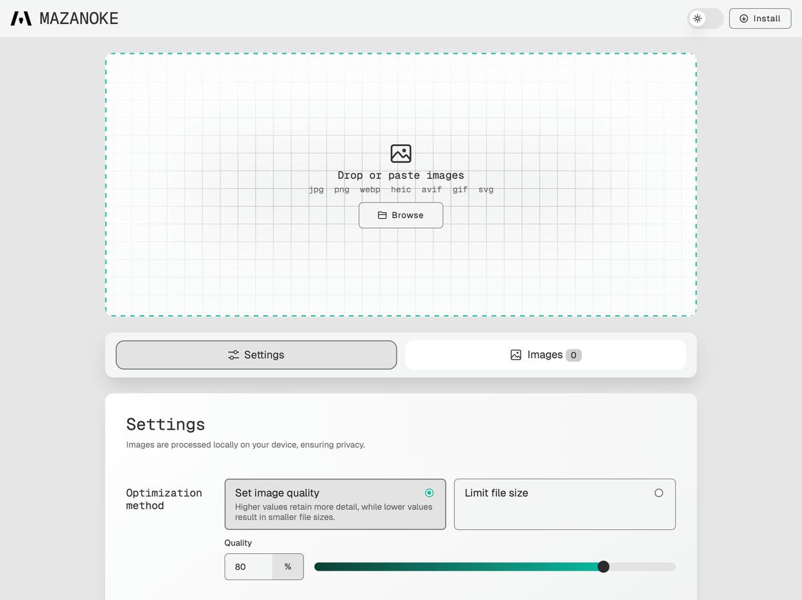
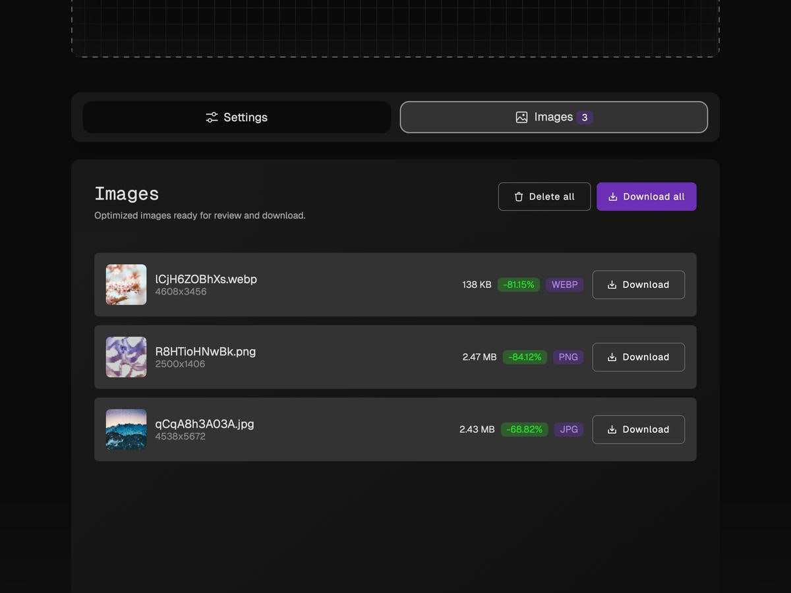

<h1 align="center">
  

   MAZANOKE
</h1>

<h2 align="center"> A self-hosted local image optimizer that runs in your browser.</h2>


<center>
   
</center>

## About
MAZANOKE is a simple image optimizer that runs in your browser, works offline, and keeps your images private without ever leaving your device.

Created for everyday people and designed to be shared with family and friends, it serves as an alternative to questionable "free" online tools.

## Table of Content
- [Features](#features)
- [Install](#install)
- [Screenshots](#screenshots)
- [Attributions](#attributions)

## Features

- 🖼️ **Optimize Images in Your Browser**
  - Adjust image quality
  - Set target file size
  - Set max width/height
  - Paste images from clipboard
  - Convert between and to `JPG`, `PNG`, `WebP`
  - Convert from `HEIC`, `AVIF`, `GIF`, `SVG`
- 🔒 **Privacy-Focused**
  - Works offline
  - On-device image processing
  - Removes EXIF data (location, date, etc.)
  - No tracking
  - Installable web app ([learn more](#web-app))

**Planned**
- [X] Upload multiple files at once
- [X] Support for more image file types
  - Recently added conversion from: `HEIC`, `AVIF`, `GIF`, `SVG` → `JPG/PNG/WebP`
- [X] Remember last-used settings
- [ ] Image cropping

## Install

### Docker

1. Using [Docker Compose](https://docs.docker.com/compose/):
```
services:
  mazanoke:
    container_name: mazanoke
    image: ghcr.io/civilblur/mazanoke:latest
    ports:
      - "3474:80"
```
2. Access the app at `http://localhost:3474`

### Local

1. Download the [latest source code release](https://github.com/civilblur/mazanoke/releases).
1. Open the `index.html` file to launch the app in your browser.

### Web App

1. Visit [MAZANOKE.com](https://mazanoke.com/), or self-host for even stronger privacy.
1. Click the "Install" button in the top-right.
   - If the button isn’t available, you can still install it manually in a few simple clicks. ([See how](./docs/install-web-app.md))
1. A shortcut to MAZANOKE will be added to your device and can even be used offline.


## Screenshots

<center>
   
</center>

<center>
   
</center>

|    |   |
| :---: | :---: |
| Dark mode<br> | Light mode<br>  |
| Settings<br>  | Download images<br>  |

## Attributions
- [Browser Image Compression](https://github.com/Donaldcwl/browser-image-compression)
- [heic-to](https://github.com/hoppergee/heic-to), [libheif](https://github.com/strukturag/libheif), [libde265](https://github.com/strukturag/libde265)
- [JSZip](https://github.com/Stuk/jszip)

[View full list and details](./docs/ATTRIBUTIONS.md)

## License
[GNU General Public License v3.0](https://github.com/civilblur/mazanoke/blob/main/README.md)