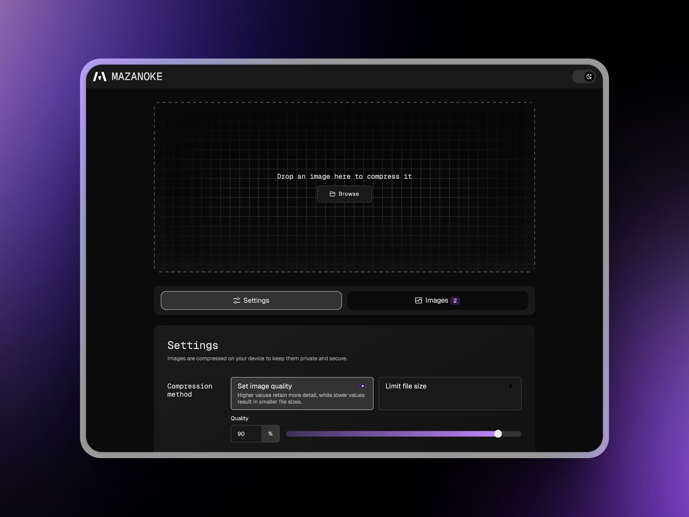
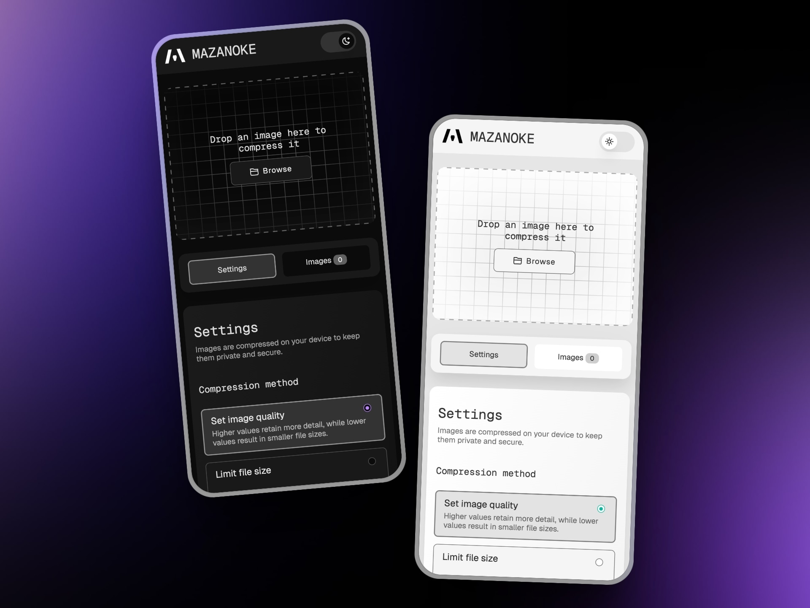
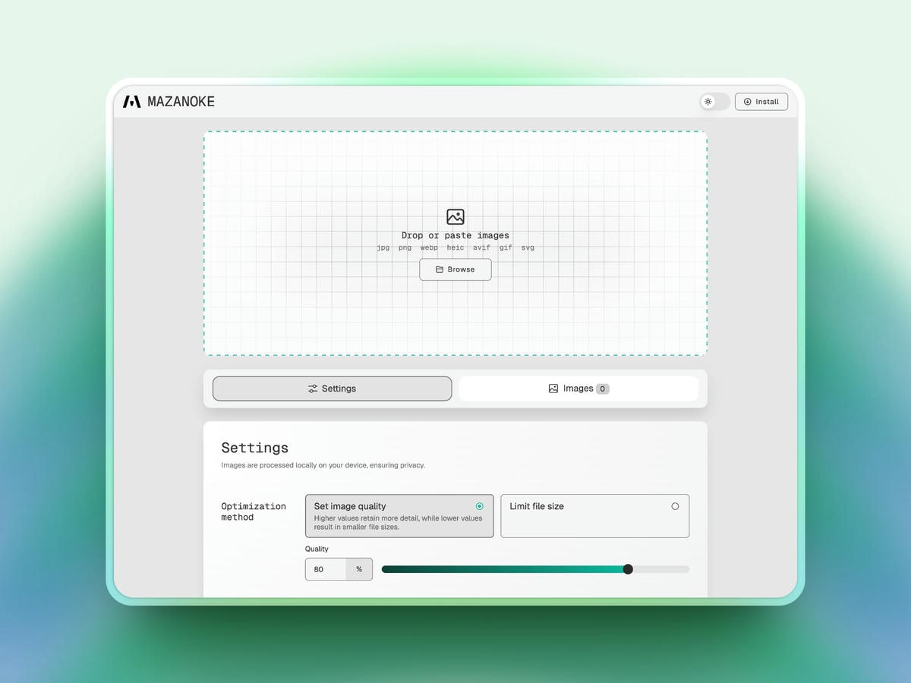
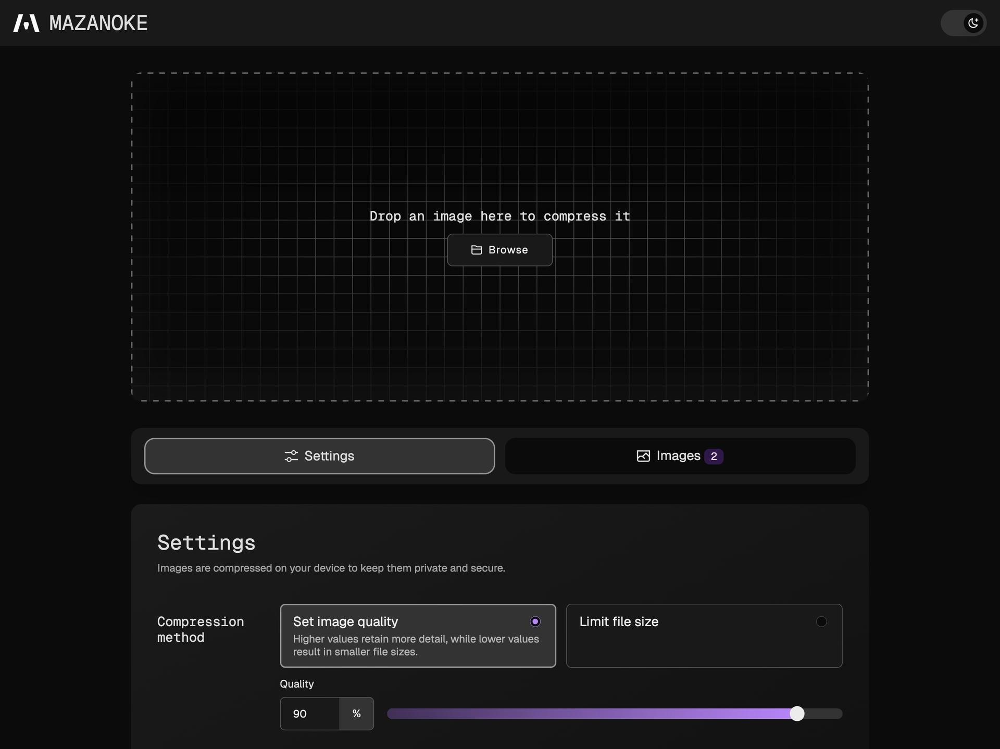
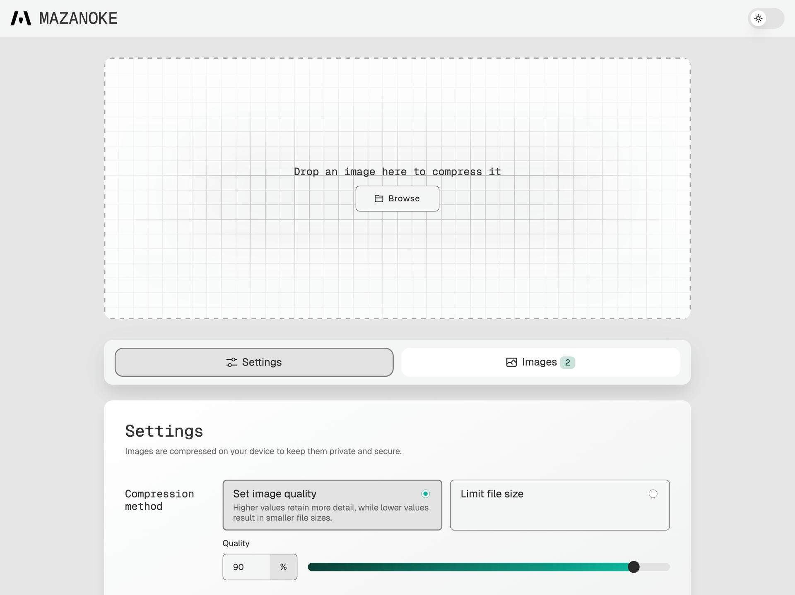
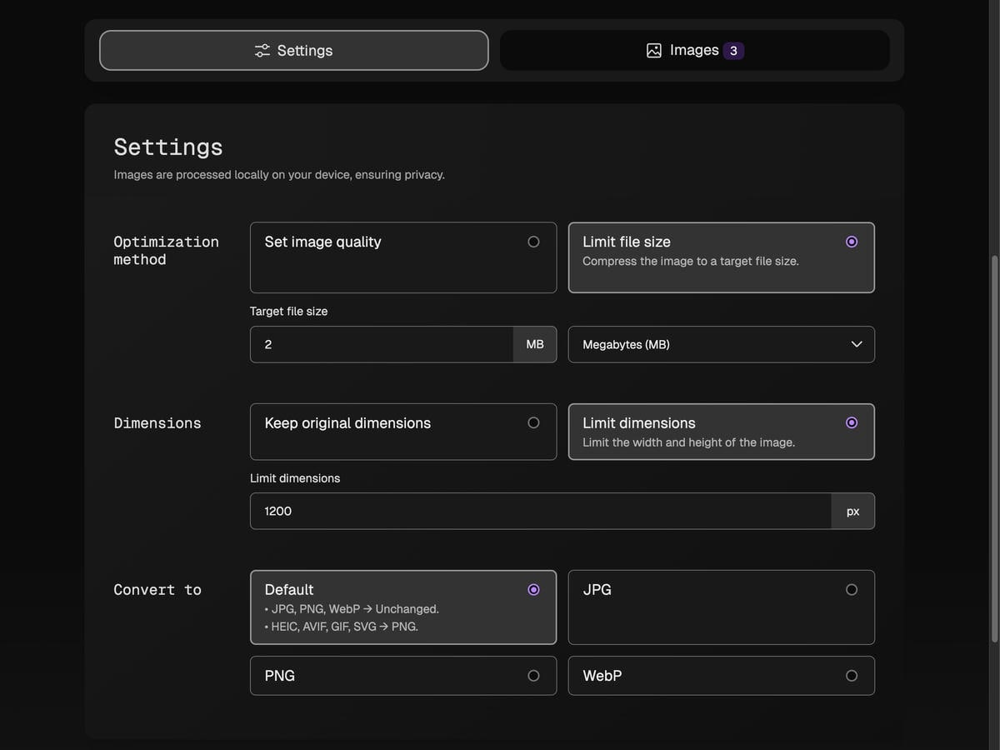
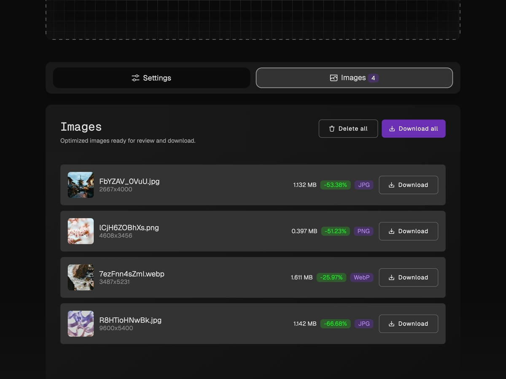

<h1 align="center">
  

   MAZANOKE
</h1>

<h2 align="center"> A self-hosted local image optimizer that runs in your browser.</h2>


<center>
   
</center>

## About
MAZANOKE is a simple image optimizer that runs in your browser, works offline, and keeps your images private without ever leaving your device.

## Table of Content
- [Features](#features)
- [Install](#install)
- [Screenshots](#screenshots)
- [Attributions and Licenses](#attributions-and-licenses)

## Features

- 🚀 **Optimizes Images Instantly in Your Browser**
  - Adjust image quality.
  - Set a target file size.
  - Set max dimensions to limit width/height.
  - Paste images directly from your clipboard.
  - Convert between `JPG`, `PNG`, and `WebP`.
    - Also supports conversion from `HEIC`, `AVIF`, `GIF`, `SVG`.
- 🌍 **Installable Web App**
  - Use as a Progressive Web App (PWA).
  - Dark and light mode.
  - Runs on desktop, tablet, and mobile.
- 🔒 **Privacy-Focused**
  - Works offline.
  - All image processing happens locally and never leaves your device.
  - Removes EXIF data, like location, date, device info, and more.

**Planned**
- [X] Upload multiple files at once. (Completed)
- [X] Support for more image file types.
  - Recently added conversion from: `HEIC`, `AVIF`, `GIF`, `SVG` → `JPG/PNG/WebP`.
- [X] Remember last-used settings.
- [ ] Image cropping.

## Install

### Docker

1. Using [Docker Compose](https://docs.docker.com/compose/):
```
services:
  mazanoke:
    container_name: mazanoke
    image: ghcr.io/civilblur/mazanoke:latest
    ports:
      - "3474:80"
```
1. Access the app at http://localhost:3474

### Local Browser

1. Download the [latest source code release](https://github.com/civilblur/mazanoke/releases).
1. Open the `index.html` file to launch the app in your browser.

### Install Web App (Desktop, Mobile)

1. Go to [MAZANOKE.com](https://mazanoke.com/), or self-host your own for even stronger privacy.
1. If your browser supports web apps, you will see an "Install" button in the top-right. Click to install.
1. A shortcut to MAZANOKE is now added to your device, and can be used even without an internet connection.


## Screenshots

<center>
   
</center>

<center>
   
</center>

|    |   |
| :---: | :---: |
| Dark mode<br> | Light mode<br>  |
| Settings<br>  | Download optimized images<br>  |

## Attributions
- [Browser Image Compression](https://github.com/Donaldcwl/browser-image-compression)
- [heic-to](https://github.com/hoppergee/heic-to), [libheif](https://github.com/strukturag/libheif), [libde265](https://github.com/strukturag/libde265)
- [JSZip](https://github.com/Stuk/jszip)

[View all details](./docs/ATTRIBUTIONS.md)

## License
[GNU General Public License v3.0](https://github.com/civilblur/mazanoke/blob/main/README.md)