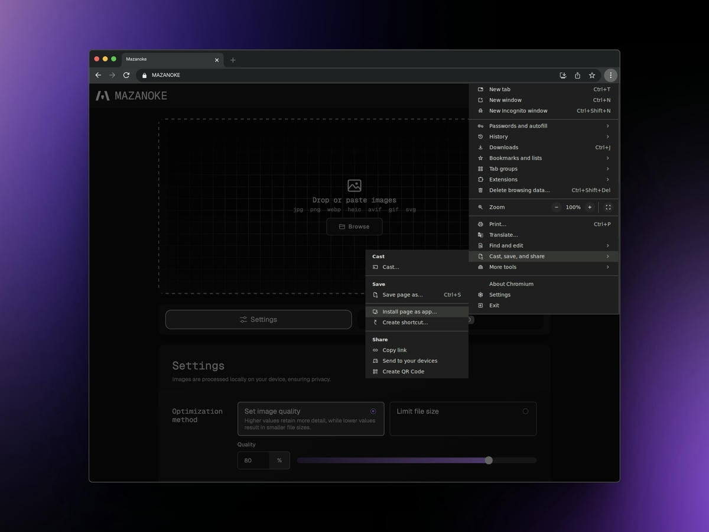
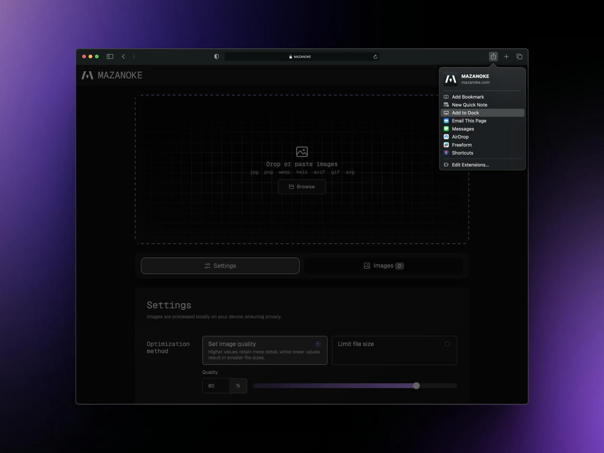
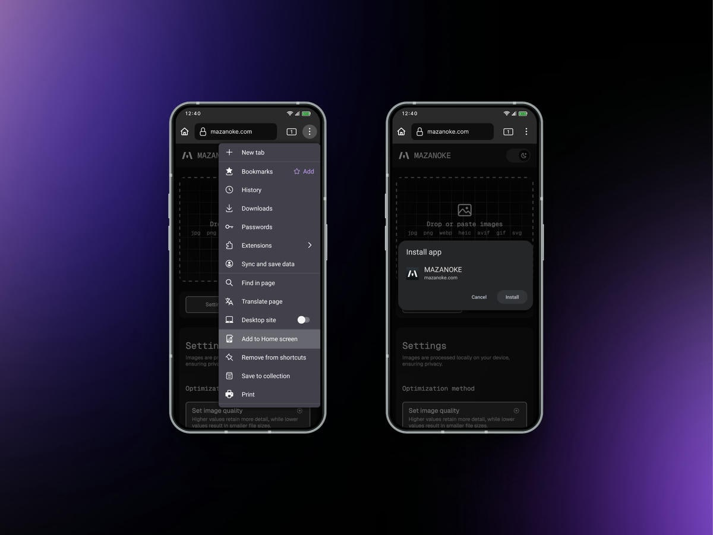
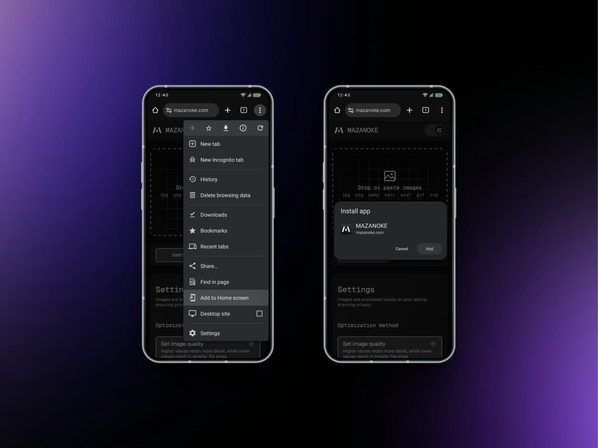
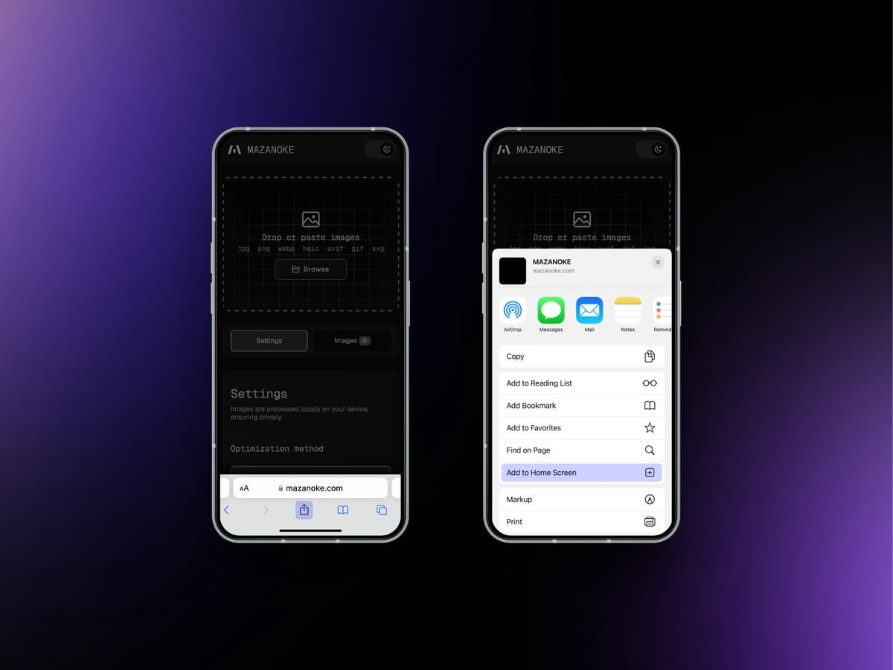

# Install MAZANOKE as Web App

MAZANOKE can be installed as a Progressive Web App (PWA), letting you use it like a native app on your device.

Visit [MAZANOKE.com](https://mazanoke.com) and click the "Install" button in the top-right corner. This button appears when MAZANOKE detects browser support for PWA.

**If you don’t see the "Install" button, you can still manually install MAZANOKE in just a few simple clicks**, see how in the section "[Manual install](#manual-install)".

## Manual Install

Instructions are provided for all major browsers, but the steps are similar for derivative browsers. As of writing, the desktop version of Firefox does not natively support PWA.

**Desktop**
- [Chrome](#chrome-desktop)
- [Safari](#safari-desktop)

**Mobile**
- [Firefox](#firefox-mobile)
- [Chrome](#chrome-mobile)
- [Safari](#safari-mobile)

### Chrome (Desktop)

1. Click the three-dot icon to open the more menu.
1. Move the cursor to hover "Cast, save, and share".
1. Click "Install page as app".
1. A prompt will show up, click "Install".

### Safari (Desktop)

1. Click and open the share sheet.
1. Click "Add to Dock".
1. A prompt will show up, click "Add".

### Firefox (Mobile)
1. Tap the three-dot icon to open the more menu.
1. Tap "Add App to Home Screen".
1. A prompt will show up, tap "Add".

### Chrome (Mobile)
1. Tap the three-dot icon to open the more menu.
1. Tap "Add to Home screen".
1. A prompt will show up, tap "Install".

### Safari (Mobile)
1. Tap and open the share sheet.
1. Tap "Add to Home Screen".
1. A prompt will show up, tap "Add".

